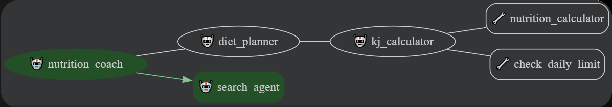
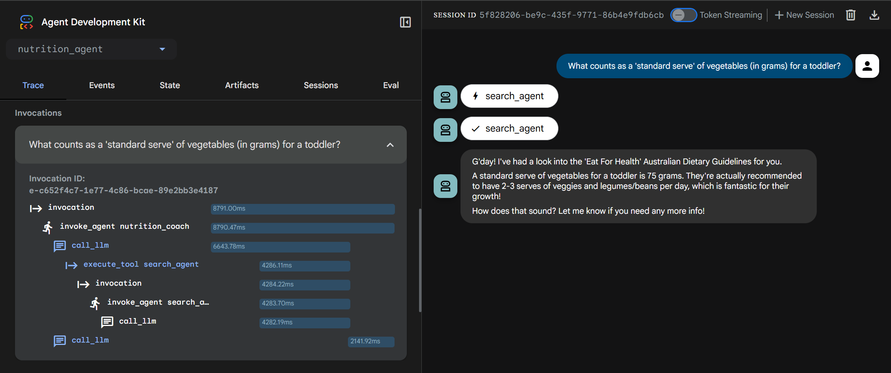
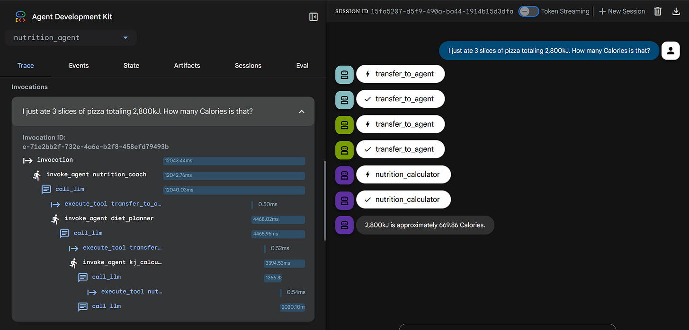
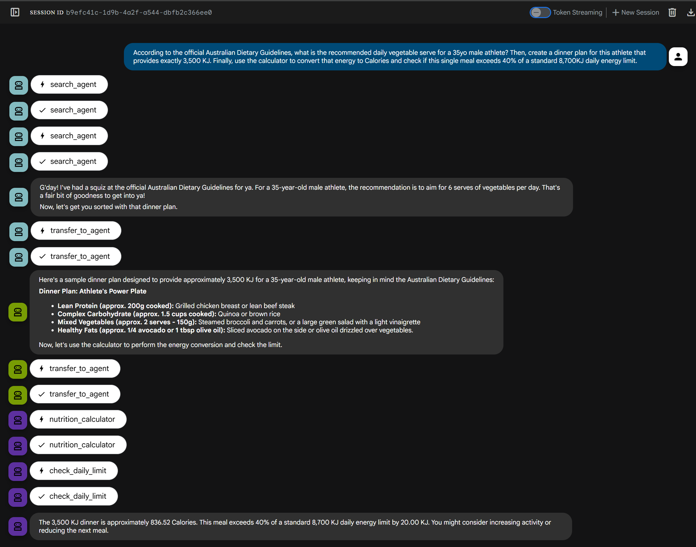

# Build a Multi-Agent using Google’s ADK + Vertex AI Search.

This project demonstrates how to build a multi-layered and grounded AI agent using **Agent Development Kit (ADK)** and **Vertex AI Search**. Unlike a simple chatbot, this Nutrition Coach uses a "CEO-to-Worker" hierarchy to research official guidelines, perform precise energy calculations, and generate meal plans. 

## 🍰 The Architecture: A Layered Strategy

In the ADK framework, we use a Parent-Child hierarchy. This ensures "Single Responsibility" - the high-level Coach handles the user, while specialized sub-agents handle the data and math.



1. Root Layer (Nutrition Coach): The Orchestrator. It listens to the user and delegates tasks.
2. Sub-Agent Layer (The Specialists):
   * Search Agent: A RAG (Retrieval-Augmented Generation) specialist grounded in the Australian Dietary Guidelines, enabled with Vertex AI Search
   * Diet Planner: A manager that coordinates meal planning logic.
3. Sub-Sub-Agent Layer (The Workers):
   * KJ Calculator: A pure numerical worker for kJ <-> Calorie conversions, acting as custom tools

## 📋 Prerequisites

- A Google Cloud Project with the Vertex AI API enabled.
- A Cloud Shell environment or a local environment with the Google Cloud SDK installed and configured.
- Python 3.10 or higher.

## 🛠️ Setup

1.  **Clone the repository:**


    ```bash
    git clone https://github.com/simonleewm/multi-agent-with-rag.git
    cd multi-agent-adk-with-rag 
    ```

2.  **Set up your environment and install dependencies:**

    Update your `PATH` environment variable and install the required Python packages.

    ```bash
    export PATH=$PATH:"/home/${USER}/.local/bin"
    python3 -m pip install -r requirements.txt
    ```

3.  **Data Ingestion and Vertex AI Search data store setup:**

    To prevent hallucinations, we ground our agents using the PDF booklet: eatforhealth.gov.au Australian Dietary Guidelines Summary https://www.eatforhealth.gov.au/sites/default/files/files/the_guidelines/n55a_australian_dietary_guidelines_summary_book.pdf.

    *   **Create a GCS Bucket:** 
        - Create a bucket and store the PDF booklet (copy available in the cloned repo) to a Google Cloud Storage, eg: `gs://nutrition-coach-bucket`
    *   **Setup Vertex AI Search:**
        -   In the Google Cloud Console, navigate to **Vertex AI Search**.
        -   Create a new **Search** app.
        -   **Data Store Creation:**
            -   Data source: **Cloud Storage**
            -   Data type: **Unstructured documents**
            -   Select the PDF file from your GCS bucket (e.g., `gs://nutrition-advisor-docs/n55a_australian_dietary_guidelines_summary_book.pdf`).
            -   Location: **global** (or your preferred location)
            -   Data store name: `aus-dietary-guidelines-ds`
            -   Document parser: **Layout Parser**
            -   Enable table annotation: **Enabled**
            -   Include ancestor headings in chunks: **Enabled**
        -   **Search App Configuration:**
            -   App type: **Custom search (general)**
            -   App name: `Nutrition Search` (or similar)
            -   Company name: `Nutrition Advisor` (or similar)
            -   Location: **global** (or your preferred location)
            -   Data store: `aus-dietary-guidelines-ds`

4.  **Project Structure:**

    Your folder structure must follow the ADK package convention to enable the ADK web UI:

    ```
    multi-agent-adk-with-rag/
    ├── nutrition_agent/               <-- Root Orchestrator Package
    │   ├── sub_agents/
    │   │   ├── diet_planner/          <-- Layer 1 Sub-Agents       
    │   │   │   ├── sub_agents/      
    │   │   │   │   ├── kj_calculator/ <-- Layer 2 Sub-Agents
    │   │   │   │   │   ├── agent.py
    │   │   │   │   │   └── tools.py
    │   │   │   └── agent.py
    │   │   ├── search_agent/        
    │   │   │   └── agent.py
    │   ├── .env
    │   ├── __init__.py                <-- Exports root_agent
    │   ├── agent.py                   <-- Root Coach logic
    │   └── callback_logging.py                 
    └── requirements.txt
    ```

    In `nutrition_agent/agent.py`, notice the `root_agent` uses sub-agents instead of a direct search tool. To handle grounded search alongside other tools, we use the ADK `AgentTool`. This allows us to wrap a specialised search agent as a tool, bypassing the restriction of mixing search and non-search tools in a single agent.

    **The `AgentTool` Configuration:**
    Within the `root_agent`'s tool list, configure the `AgentTool()` with:
    - **`agent`**: Set to the sub-agent utilizing your `VertexAiSearchTool`.
    - **`skip_summarization`**: Set to `False` so the agent reports search findings directly.

    > **Note:** Ensure your Vertex AI Search Data Store is fully indexed (check the **Documents** tab in the Google Cloud Console) before running the agent.

5.  **Environment Configuration:**

    Create a `.env` file in your `nutrition_agent` folder:

    ```
    GOOGLE_GENAI_USE_VERTEXAI=TRUE
    GOOGLE_CLOUD_PROJECT=<YOUR_PROJECT_ID>
    GOOGLE_CLOUD_LOCATION=us-central1
    MODEL=gemini-2.5-flash
    SEARCH_ENGINE_ID=<YOUR_SEARCH_ENGINE_ID> # Get this from the Vertex AI Search Data Store details
    ```

## 🧪 The Demo: Conversation Layers

Once you run `adk web`, you can interact with the system across three levels of complexity:

**Layer 1: Nutrition Research**

User: "What counts as a 'standard serve' of vegetables (in grams) for a toddler?"

Agent: "G'day! I've checked the official Australian Dietary Guidelines for you. A standard serve of vegetables for a toddler is indeed 75g. Roughly ½ a cup of cooked veggies or 1 cup of raw leafy greens."



**Layer 2: Analytical Calculation**

User: "I just ate 3 slices of pizza totaling 2,800kJ. How many Calories is that?"

Agent: "2,800kJ is approximately 669.22 Calories."



**Layer 3: Search, Plan and Calculate**

User: "According to the official Australian Dietary Guidelines, what is the recommended daily vegetable serve for a 35yo male athlete? Then, create a dinner plan for this athlete that provides exactly 3,500 KJ. Finally, use the calculator to convert that energy to Calories and check if this single meal exceeds 40% of a standard 8,700KJ daily energy limit."

Behind the Scenes:
1. Search Agent (RAG): Accesses the Australian Dietary Guidelines to identify that a 35-year-old male requires 6 serves of vegetables daily.
2. Diet Planner (Manager): Designs the "Athlete's Power Plate" (Lean protein, quinoa, and 2 serves of veggies) specifically calibrated for a high-energy 3,500kJ requirement.
3. KJ Calculator (Worker): Performs the conversion: 3,500kJ =~ 836.52kcal. Executes the check_daily_limit tool: Compares 3,500kJ against 40% of 8,700kJ (3,480kJ).
4. The Coach (Synthesizer): Delivers the final assessment—confirming the meal is compliant with guidelines but flags that it exceeds the specific 40% threshold by 20kJ.



## 🚀 Deployment
To make the agent available for use in other applications, you need to deploy it to Agent Engine.

**Deploy the Agent**

Run the following command to deploy the nutrition_agent to Agent Engine. Replace <YOUR_STAGING_BUCKET> with the name of a Cloud Storage bucket in your project.

```
adk deploy agent_engine nutrition_agent --display_name "Nutrition Coach" --staging_bucket <YOUR_STAGING_BUCKET>
```

Note: During the deployment process, you will be prompted to grant the `Vertex AI User` and `Discovery Engine User` IAM roles to the `Vertex AI Reasoning Engine Service Agent`. After the deployment is complete, the agent's resource name will be printed to the console. 


